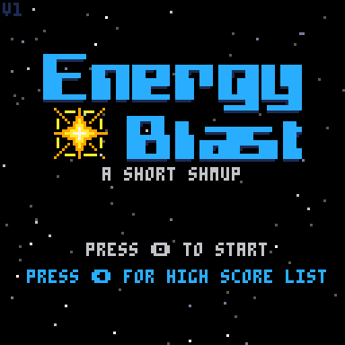
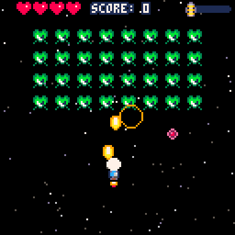

# Energy Blast - A Short Shmup

Energy Blast is a short arcade shoot'em up game created in a "fantasy video game console" Pico-8. It was made as a way to grasp the whole process of creating a video game. It included creating music, sound effects and sprites as well as writing the code and learning common video games' coding patterns. 

Most of the game is based on the [Making a Schmup](https://www.youtube.com/watch?v=81WM_cjp9fo) tutorial by Lazy Devs, with various additions created by myself. 

## Pico-8

[Pico-8](https://www.lexaloffle.com/pico-8.php) is a set of tools that emulates non-existent 8-bit console. It is deliberately very limited in technical capabilities (for example, only 128x128, 16 colours screens and 4-channel sounds) to encourage creative designs and building games from the ground up (well, nearly!). It features tools for editing sprites, music, sound and code (in modified Lua).

## How to Play

You can play it [here](https://www.lexaloffle.com/bbs/?tid=50258).

-   Arrow keys - Move the ship
-   X or M or V - Shoot
-   Z or N or C - Bomb (Depletes your energy bar)

The game features nine waves and only one life (but with four health points!). Enemies can drop energy canisters when defeated. The more energy you have, the more powerful the bomb attack will be. If you lose any health and collect nine energy canisters, the next pick up will be an extra health point. 
